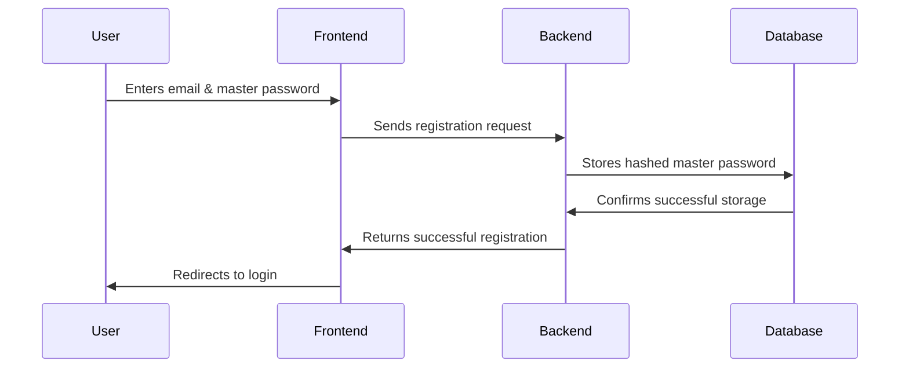
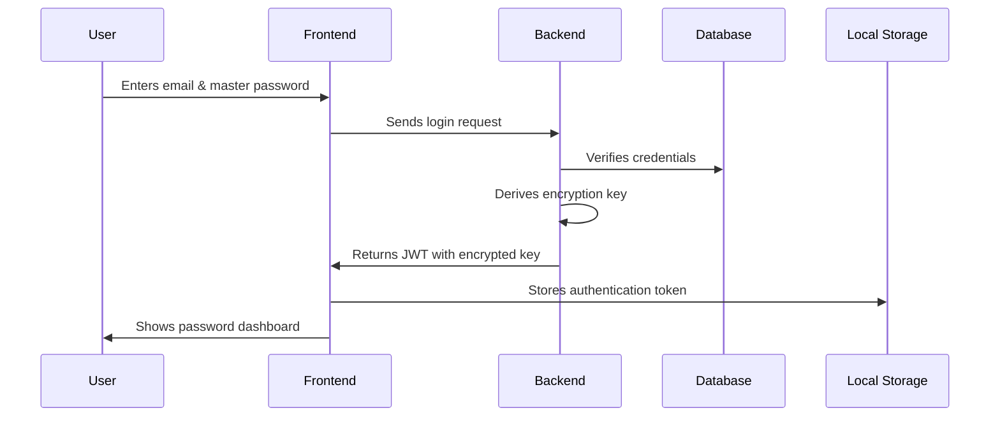
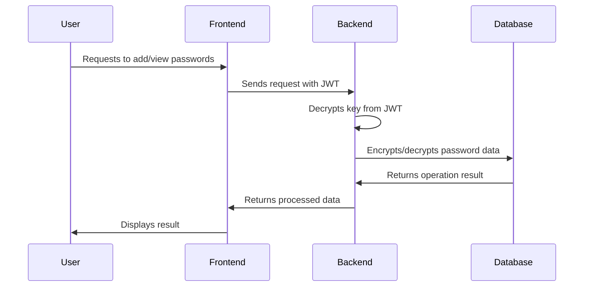

# SupaSafe - Secure Password Management

<div align="center">
  


[](https://choosealicense.com/licenses/mit/)
[](https://nodejs.org/)
[](https://reactjs.org/)
[](https://www.postgresql.org/)
[](https://expressjs.com/)

</div>

## 🔒 Overview

SupaSafe is a high-security password management solution designed with enterprise-grade encryption standards. Our application empowers users to securely store, manage, and retrieve sensitive credentials through an intuitive interface while maintaining rigorous security protocols.

<div align="center">
  
</div>

## ✨ Key Features

- **End-to-End Encryption**: AES-256 encryption for all stored credentials
- **Zero-Knowledge Architecture**: Your master password never leaves your device
- **Intuitive User Experience**: Simple yet powerful interface for managing your digital life
- **Cross-Platform Access**: Secure your passwords across all your devices
- **Password Health Analysis**: Identify weak or compromised passwords
- **Secure Password Generator**: Create strong, unique passwords with ease

## 🔐 Security Architecture

SupaSafe employs a robust security model:

1. **User Authentication**
   - bcrypt password hashing with individual salts
   - JWT-based authentication with encrypted payload
   
2. **Password Encryption**
   - AES-256 encryption for all stored credentials
   - Unique initialization vectors (IV) for each password
   - Master key derived using PBKDF2 key stretching

3. **Secure Architecture**
   - Zero-knowledge design
   - Forward secrecy implementation
   - Regular security audits

<div align="center">
  
</div>

## 🌐 User Workflow

<div align="center">
  
</div>

### Sign Up


### Login


### Password Management


## 🧠 Technical Stack

### Frontend
- **React**: UI framework
- **Tailwind CSS**: Styling
- **Redux**: State management
- **Axios**: API requests

### Backend
- **Node.js**: Runtime environment
- **Express**: Web framework
- **PostgreSQL**: Database
- **Prisma**: ORM
- **JWT**: Authentication

### Security
- **crypto (Node.js)**: AES-256 encryption
- **bcrypt**: Password hashing
- **helmet**: HTTP security headers

### DevOps
- **Docker**: Containerization
- **GitHub Actions**: CI/CD
- **Jest**: Testing
- **ESLint/Prettier**: Code quality

## 📊 Project Structure

```
SupaSafe/
│── client/                # Frontend React application
│   ├── public/            # Static assets
│   │   ├── components/    # UI components
│   │   ├── pages/         # Application pages
│   │   ├── services/      # API service layer
│   │   ├── utils/         # Helper utilities
│   │   └── store/         # Redux store
│── server/                # Backend Node.js application
│   ├── src/               # Source code
│   │   ├── controllers/   # API controllers
│   │   ├── services/      # Business logic
│   │   ├── models/        # Database models
│   │   ├── middleware/    # Express middleware
│   │   ├── utils/         # Helper functions
│   │   └── config/        # Configuration
│   ├── tests/             # Unit and integration tests
│── docker/                # Docker configuration
│── .github/workflows/     # CI/CD pipeline definitions
│── docs/                  # Documentation
```

## 🚀 Getting Started

### Prerequisites
- Node.js (v16+)
- PostgreSQL (v13+)
- Docker (optional)

### Installation

```bash
# Clone the repository
git clone https://github.com/yourusername/supasafe.git
cd supasafe

# Install dependencies
npm install

# Set up environment variables
cp .env.example .env

# Run database migrations
npx prisma migrate dev

# Start the development server
npm run dev
```

## 📝 License

This project is licensed under the MIT License - see the [LICENSE](LICENSE) file for details.

## 🔗 Links

- [Website](https://supasafe.example.com)
- [Documentation](https://docs.supasafe.example.com)
- [Report a Bug](https://github.com/yourusername/supasafe/issues)
- [Request a Feature](https://github.com/yourusername/supasafe/issues)

---

<div align="center">
  <p>Made with ❤️ by SupaSafe Team</p>
</div>
